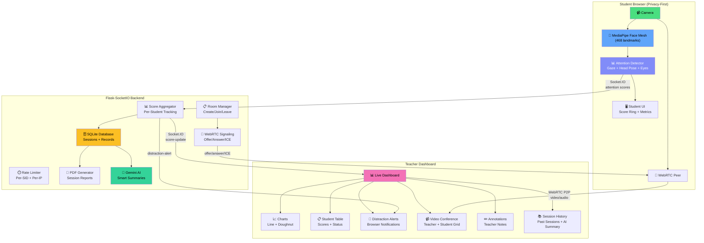
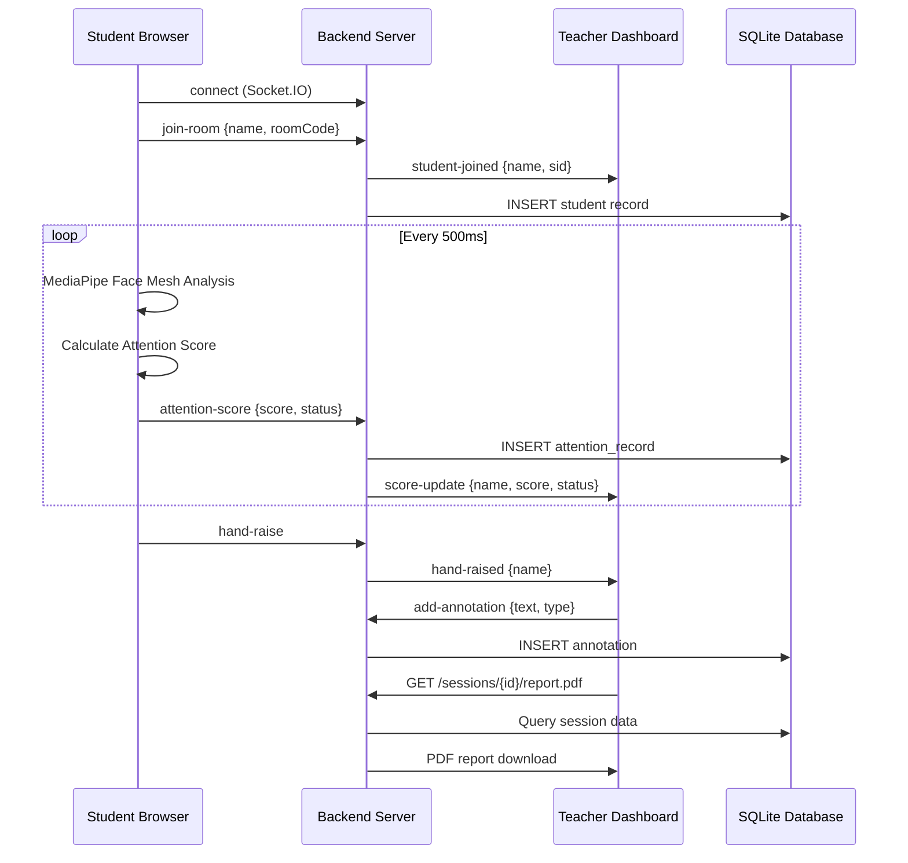

# Gaze — Real-Time Attention Monitoring System

<div align="center">

**An AI-powered classroom attention monitoring system with built-in video conferencing**

[](https://python.org)
[](https://flask.palletsprojects.com)
[](https://webrtc.org)
[](https://mediapipe.dev)
[](tests/)
[](LICENSE)

</div>

---

## 📋 Table of Contents

- [Overview](#overview)
- [System Architecture](#-system-architecture)
- [Features](#-features)
- [Attention Score Algorithm](#-attention-score-algorithm)
- [Technology Stack](#-technology-stack)
- [Installation & Setup](#-installation--setup)
- [Usage](#-usage)
- [API Documentation](#-api-documentation)
- [Testing](#-testing)
- [Project Structure](#-project-structure)
- [Privacy & Security](#-privacy--security)
- [Configuration](#-configuration)
- [Deployment](#-deployment)

---

## Overview

Gaze is a full-stack real-time attention monitoring system designed for virtual and hybrid classrooms. Teachers create sessions, students join via room codes, and the system uses **AI-powered face and gaze detection** to track engagement — all with **privacy-first local processing**.

### How It Works

1. **Teacher** opens the dashboard, authenticates, and creates a classroom
2. **Students** join using a 6-character room code — video conferencing starts
3. **AI attention detection** runs locally in each student's browser using MediaPipe Face Mesh
4. **Real-time dashboard** shows live scores, charts, distraction alerts, and session analytics

---

## 🏗️ System Architecture



### Data Flow



---

## ✨ Features

### Core Features
| Feature | Description |
|---------|-------------|
| 📹 **Video Conferencing** | WebRTC peer-to-peer video with room codes |
| 🧠 **AI Attention Detection** | MediaPipe Face Mesh — gaze, head pose, eye tracking, blink rate |
| 📊 **Live Dashboard** | Real-time charts, distribution visualization, student table |
| 💬 **Chat System** | In-session text chat between students and teacher |
| 🖥️ **Screen Sharing** | Share screen alongside video feed |

### Monitoring & Analytics
| Feature | Description |
|---------|-------------|
| 🔔 **Distraction Alerts** | Browser notifications when students lose focus |
| ✏️ **Teacher Annotations** | Bookmark moments during sessions with notes |
| ✋ **Hand Raise** | Students raise hand with visual indicator for teacher |
| 😀 **Reactions** | 6 emoji reactions (👍 😕 ❓ 🎉 👏 ❤️) |
| 📈 **Attention Trends** | Line chart tracking class attention over time |
| 📊 **Status Distribution** | Doughnut chart showing focused/partial/distracted split |

### Session Management
| Feature | Description |
|---------|-------------|
| 🤖 **AI Summaries** | Google Gemini-powered session analysis (with rule-based fallback) |
| 📄 **PDF Reports** | Downloadable session reports with charts and stats |
| 📚 **Session History** | Browse and review all past sessions |
| 📤 **CSV Export** | Export raw attention data for analysis |
| 🗄️ **Data Persistence** | SQLite storage for all session data |

### Technical Features
| Feature | Description |
|---------|-------------|
| 🔒 **Privacy-First** | All video processing is local — only scores are transmitted |
| 🌙 **Dark/Light Theme** | Toggle between dark and light modes |
| ⌨️ **Keyboard Shortcuts** | M (mic), V (camera), H (hand raise), Esc (leave) |
| 🔄 **Auto Reconnection** | Exponential backoff reconnection with auto-rejoin |
| ⏱️ **Rate Limiting** | Per-SID and per-IP rate limiting with connection throttling |
| 📱 **Mobile Responsive** | Works on tablets and phones |
| 🐳 **Docker Support** | Containerized deployment |
| 📖 **API Documentation** | Built-in interactive API docs at `/api/docs` |

---

## 🧠 Attention Score Algorithm

The attention score is computed from **4 weighted components**, each derived from the **468 facial landmarks** detected by MediaPipe Face Mesh:

| Component | Weight | How It's Measured |
|-----------|--------|-------------------|
| **Gaze Score** | 35% | Iris position relative to eye corners — centered = focused |
| **Head Pose** | 30% | Pitch/yaw/roll from 3D landmark positions — forward-facing = focused |
| **Eye Openness** | 25% | Eye aspect ratio (EAR) — open eyes = alert, droopy = fatigued |
| **Face Presence** | 10% | Binary — face detected in frame |

### Classification Thresholds

| Status | Score Range | Description |
|--------|------------|-------------|
| 🟢 **Focused** | ≥ 70% | Student is actively engaged |
| 🟡 **Partial** | 40% – 69% | Some attention, may be drifting |
| 🔴 **Distracted** | < 40% | Student is not paying attention |

### Processing Pipeline

```
Camera Frame → MediaPipe Face Mesh → 468 Landmarks
    → Gaze Vector Calculation (iris position)
    → Head Pose Estimation (Euler angles)
    → Eye Aspect Ratio (blink detection)
    → Weighted Score = 0.35×Gaze + 0.30×Head + 0.25×Eye + 0.10×Face
    → Classify: Focused | Partial | Distracted
    → Send score to server via Socket.IO
```

---

## 🛠️ Technology Stack

| Layer | Technology | Purpose |
|-------|-----------|---------|
| **AI/ML** | MediaPipe Face Mesh | 468-point facial landmark detection |
| **Frontend** | HTML5, CSS3, JavaScript | Student and teacher UIs |
| **Backend** | Flask, Flask-SocketIO | REST API + WebSocket server |
| **Real-time** | Socket.IO | Bidirectional event communication |
| **Video** | WebRTC | Peer-to-peer video conferencing |
| **Database** | SQLite | Session, student, and attention data |
| **Charts** | Chart.js | Live attention and distribution charts |
| **AI Summary** | Google Gemini API | Smart session summaries |
| **PDF** | ReportLab | Session report generation |
| **Testing** | pytest | 60+ automated tests |
| **Deployment** | Docker, Docker Compose | Containerized deployment |

---

## 🚀 Installation & Setup

### Prerequisites
- Python 3.8+
- pip
- Modern browser with camera support (Chrome, Firefox, Edge)

### 1. Clone & Install

```bash
git clone https://github.com/adam4ever0100/Gaze.git
cd Gaze
python -m venv .venv
source .venv/bin/activate   # Windows: .venv\Scripts\activate
pip install -r requirements.txt
```

### 2. Configure Environment

```bash
cp .env.template .env
# Edit .env with your settings
```

### 3. Start Servers

**Terminal 1 — Student App:**
```bash
python main.py
```
→ http://127.0.0.1:5001

**Terminal 2 — Backend + Teacher Dashboard:**
```bash
python main.py --backend
```
→ http://127.0.0.1:5002

### 4. Optional: Enable AI Summaries

Add your Google Gemini API key to `.env`:
```
GEMINI_API_KEY=your_api_key_here
```

---

## 📖 Usage

### For Teachers
1. Open http://127.0.0.1:5002
2. Enter password (default: `teacher123`) and your name
3. Click **Create Classroom** → share the 6-char room code with students
4. Monitor attention in real-time with charts, scores, and alerts
5. Use annotations to bookmark important moments
6. Download PDF reports after the session

### For Students
1. Open http://127.0.0.1:5001
2. Enter name and room code from teacher
3. Check privacy consent and join
4. Webcam activates → attention monitoring starts automatically
5. Use ✋ to raise hand or 😀 for reactions

### Keyboard Shortcuts
| Key | Action |
|-----|--------|
| `M` | Toggle microphone |
| `V` | Toggle camera |
| `H` | Raise/lower hand |
| `Esc` | Leave room / close modal |

---

## 📡 API Documentation

Full interactive API docs available at: **http://127.0.0.1:5002/api/docs**

### REST Endpoints

| Method | Endpoint | Description |
|--------|----------|-------------|
| `GET` | `/` | Teacher dashboard |
| `GET` | `/api/dashboard` | Live dashboard data (JSON) |
| `GET` | `/api/rooms` | List active rooms |
| `GET` | `/api/sessions` | List past sessions |
| `GET` | `/sessions/{id}/summary` | Session summary |
| `GET` | `/sessions/{id}/attendance` | Attendance report |
| `GET` | `/sessions/{id}/ai-summary` | AI-generated summary |
| `GET` | `/sessions/{id}/annotations` | Session annotations |
| `GET` | `/sessions/{id}/report.pdf` | Download PDF report |
| `POST` | `/api/submit-score` | Submit attention score |

### WebSocket Events

| Event | Direction | Description |
|-------|-----------|-------------|
| `create-room` | Client → Server | Teacher creates classroom |
| `join-room` | Client → Server | Student joins room |
| `attention-score` | Client → Server | Student sends score |
| `score-update` | Server → Client | Broadcast score to teacher |
| `hand-raise` | Client → Server | Student raises hand |
| `reaction` | Client → Server | Student sends emoji |
| `add-annotation` | Client → Server | Teacher adds note |
| `distraction-alert` | Server → Client | Alert for low attention |

---

## 🧪 Testing

```bash
# Run all tests
python -m pytest tests/ -v

# Run with coverage
python -m pytest tests/ -v --tb=short
```

### Test Coverage
- **Attention Classification** — score calculation, status classification
- **Configuration Validation** — port ranges, thresholds, security settings
- **Database Operations** — CRUD for sessions, students, attention records
- **Annotations** — add, get, delete annotations
- **Attendance Reports** — student join/leave tracking
- **AI Summaries** — rule-based and Gemini integration
- **Backend API** — all REST endpoints, 404 handling
- **PDF Generation** — report generation and content verification
- **Rate Limiting** — per-SID and per-IP throttling
- **Hand Raise & Reactions** — event handling

---

## 📁 Project Structure

```
Gaze/
├── main.py                        # Entry point (--backend flag for teacher mode)
├── config.py                      # Configuration constants & validation
├── requirements.txt               # Python dependencies
├── Dockerfile                     # Container definition
├── docker-compose.yml             # Multi-container orchestration
├── .env.template                  # Environment variable template
│
├── backend/                       # Backend server
│   ├── server.py                  # Flask-SocketIO (signaling, API, dashboard)
│   └── database.py                # SQLite (sessions, students, attention, annotations)
│
├── src/                           # Student application
│   ├── ai_engine/
│   │   └── attention_detector.py  # MediaPipe attention detection (Python fallback)
│   └── api/
│       └── server.py              # Student Flask server
│
├── zoom_app/                      # Student web app (frontend)
│   ├── index.html                 # UI: video grid, join form, controls
│   ├── app.js                     # WebRTC, Socket.IO, room management
│   ├── attention.js               # Browser-side MediaPipe attention detection
│   ├── style.css                  # Dark/light theme styles
│   └── mediapipe/                 # Self-hosted MediaPipe WASM files
│
├── teacher_dashboard/             # Teacher dashboard (frontend)
│   ├── index.html                 # Dashboard: stats, charts, student table, modals
│   ├── app.js                     # Real-time updates, annotations, alerts
│   └── style.css                  # Dashboard styles
│
├── tests/
│   └── test_gaze.py               # 60+ automated tests
│
└── data/
    └── gaze.db                    # SQLite database (auto-created)
```

---

## 🔒 Privacy & Security

| Measure | Implementation |
|---------|---------------|
| **Local Processing** | All video analysis runs in-browser via WebRTC — no server-side video processing |
| **No Video Storage** | Camera frames are never sent to or stored on any server |
| **Numeric Scores Only** | Only attention scores (0-1 float) are transmitted |
| **Rate Limiting** | Per-SID (30/s) and per-IP (100/s) request limits |
| **Connection Throttling** | Max 10 connections per IP address |
| **Security Headers** | CSP, X-Content-Type-Options, X-Frame-Options applied |
| **Secret Management** | Environment variables for sensitive config |
| **Consent Required** | Students must opt-in before monitoring begins |

---

## ⚙️ Configuration

### Environment Variables

| Variable | Default | Description |
|----------|---------|-------------|
| `STUDENT_APP_PORT` | `5001` | Student app port |
| `BACKEND_PORT` | `5002` | Backend/dashboard port |
| `TEACHER_PASSWORD` | `teacher123` | Teacher login password |
| `SECRET_KEY` | `development-secret-key` | Flask secret key |
| `DEBUG` | `True` | Debug mode |
| `GEMINI_API_KEY` | *(empty)* | Google Gemini API key for AI summaries |
| `SSL_ENABLED` | `False` | Enable HTTPS |
| `TURN_SERVER_URL` | *(empty)* | TURN server for NAT traversal |

---

## 🐳 Deployment

### Docker

```bash
docker-compose up --build
```

### Manual

```bash
# Production
export DEBUG=False
export SECRET_KEY=$(python -c "import secrets; print(secrets.token_hex(32))")
export TEACHER_PASSWORD=your_secure_password
python main.py --backend &
python main.py &
```

---

## 📄 License

MIT License — see [LICENSE](LICENSE) for details.

---

<div align="center">

**Built with ❤️ for smarter classrooms**

*Gaze — Real-Time Attention Monitoring System*

</div>
